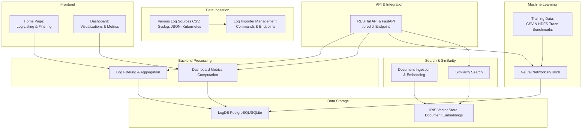

# LogFlowAI - Real-time Log Analysis & Monitoring

[](https://github.com/DhyeyMavani2003/logflowai/actions/workflows/django.yml)  [](https://coveralls.io/github/DhyeyMavani2003/logflowai) [](https://github.com/psf/black) [](https://github.com/DhyeyMavani2003/logflowai/actions/workflows/pages/pages-build-deployment) [](https://logflowai.readthedocs.io/en/latest/?badge=latest)

LogFlowAI is a web application created for real-time log analysis and monitoring. The platform ingests, filters, and visualizes log data to help teams diagnose issues and monitor system performance effectively. This project also demonstrates advanced capabilities ranging from deep learning using PyTorch to hybrid data operations via an InterSystems IRIS vector store, alongside large-scale log/data analytics using HDFS trace benchmarks.

## Key Features
- **Real-time Log Ingestion:** Stream and process logs from diverse sources including CSV files, syslog streams, JSON endpoints, and Kubernetes logs. Support both batch processing for historical data and real-time streaming with sub-second latency. Automatically handle data validation, field extraction, and timestamp normalization across multiple timezones.
- **Advanced Filtering:** Power through millions of log entries with our sophisticated search capabilities. Combine full-text search, regex patterns, and field-specific filters to pinpoint exactly what you need. Features include fuzzy matching, saved searches, query templates, and support for complex boolean operations across log level, service name, timestamp, and custom fields.
- **Dashboard Visualizations:** Transform raw logs into actionable insights with our interactive dashboards. Track key metrics like error rates and service health in real-time, visualize log patterns with heat maps and time-series graphs, and create custom views for different teams. All visualizations support drill-down capabilities and export options for deeper analysis.
- **Extensible API:** Seamlessly integrate LogFlowAI into your existing infrastructure through our comprehensive RESTful API. Ingest logs programmatically, trigger automated analyses, and export metrics to external systems. The API includes robust authentication, rate limiting, detailed documentation, and support for custom plugins to extend functionality.
- **Neural Network Architecture:** A deep learning model built in PyTorch, trained on CSV files (including preprocessed HDFS trace benchmarks) to predict outcomes based on historical data.
- **Database Architecture:** An IRIS vector store is employed for advanced document storage and similarity searches using SQL-backed operations.
- **HDFS Trace Bench Data:** Large-scale HDFS trace benchmarks provide performance metrics and error patterns, offering rich data for analytics and model training.

## Getting Started

To clone and set up the application locally, follow the instructions below.

### Clone the Repository

```bash
git clone https://github.com/DhyeyMavani2003/logflowai.git
cd logflowai
```

### Set Up a Virtual Environment

Create and activate a virtual environment to manage dependencies locally.

```bash
python3 -m venv env
source env/bin/activate
```

### Install Dependencies

```bash
pip install -r requirements.txt
```

### Run Database Migrations

Apply migrations to set up the database schema.

```bash
python manage.py makemigrations
python manage.py migrate
```

### Import Log Data

Your log data (e.g., CSV files) is located under `logapp/data/`. You can import logs using the built-in management command. For example, to import logs from a CSV:

```bash
python manage.py import_logs
```

Or, you can trigger the import from the LogFlowAI home page using the "Import Logs from CSV" button.

### Start the Development Server

To run the application locally, use the following command:

```bash
python manage.py runserver
```

Visit [http://127.0.0.1:8000/](http://127.0.0.1:8000/) in your browser to view the application.

## System Architecture & Design

LogFlowAI is built with a modular and scalable architecture. Below is a high-level diagram of the core components and their interactions.


### Architecture Components

- **LogDB:** The central database storing log entries for efficient querying.
- **Importer:** A suite of management commands and endpoints to ingest log data from various sources.
- **Home:** Displays log entries with advanced filtering options.
- **Dashboard:** Provides aggregated visual insights (e.g., logs per hour, unique services).
- **API:** RESTful endpoints to trigger log imports and fetch filtered log data.

### Functional Design

The following diagram provides a detailed breakdown of the application’s internal components and workflows.



## Neural Network Architecture

The model is implemented in PyTorch, using data loaded from several CSV files including standard splits (train, val, test) and benchmark data. A custom CSVDataset processes numerical features and converts targets into tensors.

### Dataset and Preprocessing

- Data is sourced from multiple CSV files:
    - Standard splits: train.csv, val.csv, test.csv
    - Benchmark dataset: rowNumberResult.csv (contains performance metrics from HDFS traces)
- Preprocessing involves cleaning data, extracting numerical features, and preparing tensors for model input.

### Model Architecture

The neural network (encapsulated in the Net class) includes:

- **Input Layer:** Accepts a dynamic set of features.
- **Four Hidden Layers:**
    - Layer 1: Linear (input → 128) → BatchNorm → ReLU → Dropout (0.3)
    - Layer 2: Linear (128 → 64) → BatchNorm → ReLU → Dropout (0.3)
    - Layer 3: Linear (64 → 32) → BatchNorm → ReLU → Dropout (0.3)
    - Layer 4: Linear (32 → 16) → BatchNorm → ReLU → Dropout (0.3)
- **Output Layer:** A final linear layer producing a single output, transformed via sigmoid activation to yield probabilities.

### Training and Evaluation

- **Loss Function:** Utilizes nn.BCEWithLogitsLoss() to handle raw logits.
- **Optimizer:** Adam optimizer with a learning rate typically set to 0.001.
- **Metrics:** Tracks training loss, accuracy, True Positive Rate (TPR), and True Negative Rate (TNR).
- **Model Saving:** The trained weights are saved as model.pth for deployment and inference.

### Deployment with FastAPI

- A FastAPI server (app.py) is set up to load the trained model and serve predictions via a /predict endpoint.
- The endpoint expects JSON input (a list of feature values) and returns the predicted probability and class.

### Database and Vector Store Architecture

This project leverages an advanced vector store implemented with the InterSystems IRIS driver:

- **Vectorized Document Storage:** Documents are embedded and stored in a persistent SQL table.
- **Robust Search and Reconnection:** The IRIS-based retriever supports similarity searches, ensuring persistent connections to the vector store.

### IRIS Vector Store Overview

Documents are transformed into embeddings and stored within the IRIS vector store. This allows for efficient similarity searches and analytical queries using SQL-based operations.

### Document Ingestion and Similarity Search

- **Ingestion:** Demonstrated in notebooks like langchain_demo.ipynb, where documents are processed and embedded.
- **Search:** The embedded vectors are used to perform similarity searches, facilitating quick retrieval of related documents.

### HDFS Trace Bench Data

The project incorporates HDFS trace benchmarks, particularly through files like rowNumberResult.csv, which contains measurements and performance metrics. These benchmarks are used for:

- Analyzing performance characteristics.
- Feeding relevant metrics into the neural network.
- Enriching the document store for similarity queries.

### Quickstart

1. **Clone the Repository:**
        ```bash
        git clone https://github.com/yourusername/treehacks-2025.git
        cd treehacks-2025
        ```

2. **Set Up the Environment:**
        ```bash
        python -m venv venv
        source venv/bin/activate  # On Windows: venv\Scripts\activate
        ```

3. **Install Dependencies:**
        ```bash
        pip install -r requirements.txt
        ```

4. **Run Data Preprocessing and Training:**
        ```bash
        python preprocess.py
        python train.py
        ```

5. **Start the FastAPI Server:**
        ```bash
        uvicorn app:app --reload
        ```

6. **Open and Run the Notebooks:** Explore Jupyter notebooks such as:
        - main.ipynb for training and evaluation.
        - langchain_demo.ipynb for document ingestion and similarity search features.

## Contributing

We welcome contributions to improve LogFlowAI. Please follow these guidelines:

1. **Code Formatting:**  
   Ensure your code adheres to the [Black](https://github.com/psf/black) style guidelines. Format your code by running:
   
   ```bash
   python -m black .
   ```

2. **Documentation:**  
   For adding or updating documentation, refer to the [LogFlowAI Documentation Guide](./docs/) in the `docs/` directory. This includes instructions on using Sphinx for documenting models and views.

3. **Pull Requests:**  
   Before submitting a pull request, ensure your code is well-documented, tested, and follows our coding standards.

---

For any questions or further support, please reach out to our team. Enjoy using LogFlowAI for your log analysis needs!