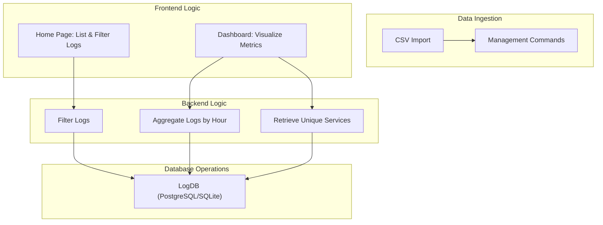

# LogFlowAI - Real-time Log Analysis & Monitoring

[](https://github.com/DhyeyMavani2003/logflowai/actions/workflows/django.yml)  [](https://coveralls.io/github/DhyeyMavani2003/logflowai) [](https://github.com/psf/black) [](https://github.com/DhyeyMavani2003/logflowai/actions/workflows/pages/pages-build-deployment) [](https://logflowai.readthedocs.io/en/latest/?badge=latest)

LogFlowAI is a web application created for real-time log analysis and monitoring. The platform ingests, filters, and visualizes log data to help teams diagnose issues and monitor system performance effectively.

## Key Features
- **Real-time Log Ingestion:** Import logs from CSV files and other sources for immediate analysis.
- **Advanced Filtering:** Search logs by query, level, service, or date range with both exact and fuzzy matching.
- **Dashboard Visualizations:** View aggregated insights such as logs per hour and unique service breakdowns.
- **API Driven:** Easily extendable with management commands and API endpoints for log import and analysis.

## Getting Started

To clone and set up the application locally, follow the instructions below.

### Clone the Repository

```bash
git clone https://github.com/DhyeyMavani2003/logflowai.git
cd logflowai
```

### Set Up a Virtual Environment

Create and activate a virtual environment to manage dependencies locally.

```bash
python3 -m venv env
source env/bin/activate
```

### Install Dependencies

```bash
pip install -r requirements.txt
```

### Run Database Migrations

Apply migrations to set up the database schema.

```bash
python manage.py makemigrations
python manage.py migrate
```

### Import Log Data

Your log data (e.g., CSV files) is located under `logapp/data/`. You can import logs using the built-in management command. For example, to import logs from a CSV:

```bash
python manage.py import_logs
```

Or, you can trigger the import from the LogFlowAI home page using the "Import Logs from CSV" button.

### Start the Development Server

To run the application locally, use the following command:

```bash
python manage.py runserver
```

Visit [http://127.0.0.1:8000/](http://127.0.0.1:8000/) in your browser to view the application.

## System Architecture & Design

LogFlowAI is built with a modular and scalable architecture. Below is a high-level diagram of the core components and their interactions.


### Architecture Components

- **LogDB:** The central database storing log entries for efficient querying.
- **Importer:** A suite of management commands and endpoints to ingest log data from various sources.
- **Home:** Displays log entries with advanced filtering options.
- **Dashboard:** Provides aggregated visual insights (e.g., logs per hour, unique services).
- **API:** RESTful endpoints to trigger log imports and fetch filtered log data.

### Functional Design

The following diagram provides a detailed breakdown of the application’s internal components and workflows.



## Contributing

We welcome contributions to improve LogFlowAI. Please follow these guidelines:

1. **Code Formatting:**  
   Ensure your code adheres to the [Black](https://github.com/psf/black) style guidelines. Format your code by running:
   
   ```bash
   python -m black .
   ```

2. **Documentation:**  
   For adding or updating documentation, refer to the [LogFlowAI Documentation Guide](./docs/) in the `docs/` directory. This includes instructions on using Sphinx for documenting models and views.

3. **Pull Requests:**  
   Before submitting a pull request, ensure your code is well-documented, tested, and follows our coding standards.

---

For any questions or further support, please reach out to our team. Enjoy using LogFlowAI for your log analysis needs!